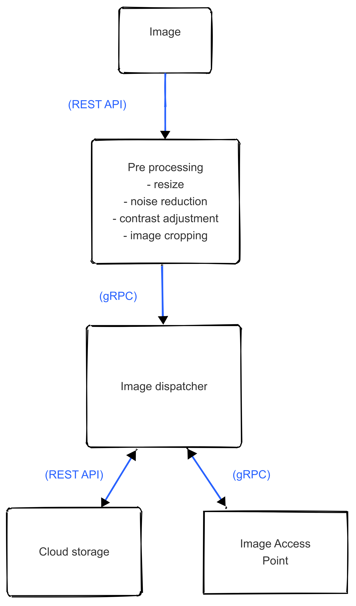

# Pneumonia Detection App - Preprocessing 

#### Phase 3 - Functional requirements and application architecture 

## Functional Requirements

(1) Users are able to upload chest X-ray images (DICOM).

(2) All uploaded images are resized to a predetermined dimension of 128x128 pixels.

(3) This filter reduces some noise through the application of a Gaussian blur.

(4) The image contrast is enhanced by extending the pixel’s intensity range from the original range to 0 to 255 (histogram equalization). 

(5) Certain regions of interest within the lungs are detected and cropped using segmentation techniques.

(6) Preprocessed images are stored in the cloud.

## Application Architecture

#### Components

* Image upload component
* Preprocessing component
* Cloud Storage component
* Access Image component

#### Interactions between these components

* User uploads an image with a REST API (HTTP POST).
* The preprocessing component fetches the image with a gRPC framework.
* This image (already processed) is stored in the cloud storage component and the cloud storage be accessed with a REST API.
* The processed image can be accessed with a gRPC framework.

## Diagram of the Application Architecture

The diagram of the application architecture is represented below. The user uploads the image, an x-ray of a patient. This image is then sent to be preprocessed through several steps: resize, noise reduction, contrast adjustment and image cropping. The image is then sent to the cloud storage, where it can be fetched by additional microservices. The image can also be accessed by the user (presumably a doctor) for additional examination and confirmation of results.

