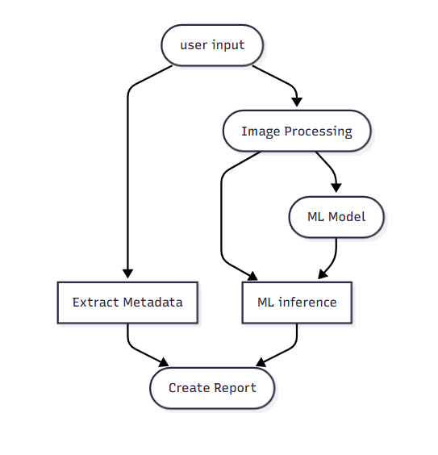

## Service Diagram

## Functional Requirements

1. Receive ML inference results
2.  Receive Patient Metadata
3. Format the report in pdf
4. Retrieval of the report to view
## Microservices Components

1.  API
	- POST /generate_report (Accepts inference and metadata and triggers report creation)
	- GET /report/{patient_id}
2.  Report Processing
	- Combines data and uses templates to create report
3. Storage
	- Uses stored information on DICOM file input by user

## Interaction with other services

- ML inference Service

## Example Workflow

1. The user inputs a .DICOM x-ray file
2. The file is passed down as an image to preprocessing and as JSON metadata for the report creation
3.  After processing and saving the image infer the ML model and get both prediction and confidence on the result
4. Merge the results from the inference with the previously saved metadata and generate the report.
